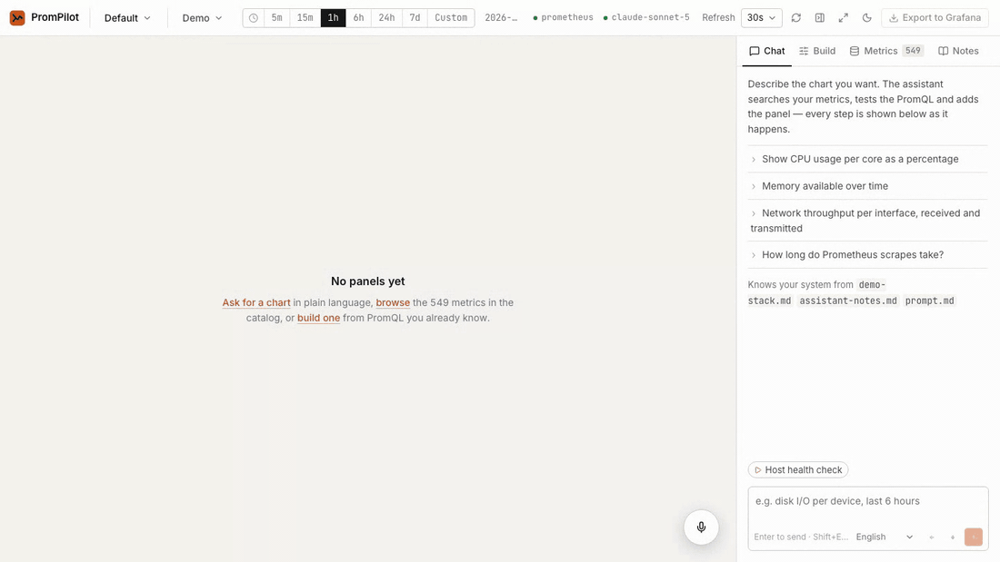

<p align="center">
  
  
</p>

<p align="center"><strong>Chat-driven Prometheus visualization with one-click Grafana export.</strong></p>

<p align="center">
  <a href="https://github.com/ismailperim/prompilot/actions/workflows/ci.yml"></a>
  <a href="https://github.com/ismailperim/prompilot/pkgs/container/prompilot"></a>
  <a href="LICENSE"></a>
</p>

PromPilot connects to your Prometheus, discovers your metrics, and lets you
build charts by asking for them in plain language. Every panel it creates can
be exported as a Grafana dashboard. It runs as a single Docker container with
no cloud dependency — bring your own LLM, including local ones via Ollama or
vLLM.

> **Status:** early — 0.1. Everything below works; expect rough edges and
> breaking changes before 1.0.

<p align="center">
  
</p>

<p align="center"><em>Hands-free: press the voice button, ask for a chart, watch the assistant test the PromQL and add the panel. <a href="docs/assets/demo.mp4">MP4</a> · <a href="docs/assets/screenshot-light.png">light</a> / <a href="docs/assets/screenshot-dark.png">dark</a> screenshots.</em></p>

## Why

Grafana is great at rendering dashboards, but building them still means
knowing which of your 5,000 metrics to pick and how to write the PromQL.
PromPilot adds a conversational layer on top:

- **Metric catalog** — metrics are discovered, categorised and indexed
  automatically, so "show me CPU per core" finds `node_cpu_seconds_total`
  without you memorising exporter names. Works without an LLM.
- **Chat → panel** — ask for a chart; the LLM picks the metric, writes and
  dry-runs the PromQL, and emits a validated panel spec. Rendering is
  deterministic — the model never writes chart code.
- **Grafana export** — download the resulting dashboard as Grafana JSON and
  import it. PromPilot is an add-on layer, not a replacement.

## Quick start

```bash
docker run -d -p 8080:8080 \
  -e PROMETHEUS_URL=http://your-prometheus:9090 \
  -e LLM_BASE_URL=http://ollama:11434/v1 \
  -e LLM_MODEL=llama3.1 \
  -v prompilot-data:/data \
  ghcr.io/ismailperim/prompilot:latest
```

Open <http://localhost:8080>.

Don't have a Prometheus handy? The repository ships a demo stack with
Prometheus and node-exporter:

```bash
git clone https://github.com/ismailperim/prompilot.git
cd prompilot
docker compose up -d
```

Add `--profile grafana` to also start Grafana (for testing exports) or
`--profile ollama` for a local LLM.

## Configuration

All configuration is via environment variables.

| Variable | Default | Description |
| --- | --- | --- |
| `PROMETHEUS_URL` | — | Prometheus (or Thanos/Mimir/VictoriaMetrics) for the first project, created on first start. Optional once projects exist. |
| `PROMETHEUS_USERNAME` / `PROMETHEUS_PASSWORD` | — | Optional basic auth. |
| `PROMETHEUS_QUERY_TIMEOUT` | `30s` | Timeout applied to every Prometheus call. |
| `PROMETHEUS_MAX_DATA_POINTS` | `1000` | Upper bound on points per series; the query step is derived from it. |
| `LLM_BASE_URL` | — | Any OpenAI-compatible endpoint (OpenAI, Ollama, vLLM, LM Studio, OpenRouter…). Chat is disabled when unset. |
| `LLM_MODEL` | — | Model name, e.g. `gpt-4o-mini`, `llama3.1`, `qwen2.5`. |
| `LLM_API_KEY` | — | API key; optional for local endpoints. |
| `LLM_TIMEOUT` | `120s` | Timeout for a single LLM request. |
| `LLM_MAX_TOKENS` | `4096` | Completion budget per model turn. Raise it for reasoning models that think before answering. |
| `LLM_TEMPERATURE` | `0.2` | Sampling temperature. |
| `LLM_EXTRA_BODY` | — | JSON merged into every request for vendor-specific options, e.g. `{"chat_template_kwargs":{"enable_thinking":false}}` to turn off Qwen thinking on vLLM. |
| `LLM_MAX_TOOL_ITERATIONS` | `8` | Cap on tool-call rounds per message; the last round must answer in text. |
| `CATALOG_LLM_ENRICH` | `false` | Use the LLM to categorise metrics the built-in rules can't. |
| `CATALOG_REBUILD_INTERVAL` | `24h` | Periodic catalog rebuild; `0` disables. |
| `CATALOG_LABEL_SAMPLE_LIMIT` | `2000` | Max metrics whose label keys are sampled per build (the rest are sampled on demand). |
| `CATALOG_CONCURRENCY` | `6` | Parallel Prometheus calls during a catalog build. |
| `AUTH_PASSWORD` | — | Enables the sign-in screen. Unset = open instance. |
| `AUTH_API_TOKEN` | — | Bearer token for scripts and automation. |
| `SECRET_KEY` | auto | Signs sessions and encrypts stored passwords; generated into `DATA_DIR/secret.key` when unset. |
| `KNOWLEDGE_DIR` | `$DATA_DIR/knowledge` | Markdown notes about your system for the agent (see below). |
| `DATA_DIR` | `/data` | SQLite storage (catalog + dashboard). Mount a volume. |
| `PORT` | `8080` | HTTP port. |
| `LOG_LEVEL` | `info` | Log level. |

## Projects

One PromPilot instance can watch several Prometheus servers. Each **project**
is one Prometheus source with its own dashboard, metric catalog and notes;
switch between them from the project menu in the top bar, or address one
directly at `/p/<slug>`. Projects are created and edited in the UI (name,
URL, optional basic auth, with a connection test) or via `/api/projects`.
No Prometheus at hand? The dialog offers the public demo servers
(`demo.promlabs.com`, `prometheus.demo.prometheus.io`).
The `PROMETHEUS_URL` environment variable creates the first project,
`default`, on first start.

A project holds any number of dashboards — create, rename, duplicate and
delete them from the top bar; each has its own address
(`/p/<project>/d/<dashboard>`), chat history and Grafana export.

Per-project notes live in `knowledge/<slug>/`; files directly in `knowledge/`
are shared by every project.

## Teaching it your system

The agent knows what a metric is called; it doesn't know what it *means* to
you. Put Markdown notes in the `knowledge/` directory (mounted into the
container as `/data/knowledge`) and they become part of the agent's context:

- `knowledge/prompt.md` — standing instructions, injected into every
  conversation: which team owns what, SLOs, preferred breakdowns, house rules.
- any other `knowledge/*.md` — notes split by heading and indexed for search.
  The agent searches them with `search_knowledge`, and the sections matching
  your question are added to the prompt automatically.

- `- \`metric_name\` — meaning` bullets attach a note to a metric; it shows
  in the metric browser and in what the agent sees.
- `knowledge/playbooks/*.md` — procedures the agent runs on request ("Host
  health check": four panels and a two-sentence verdict). They appear as
  buttons above the chat composer.

Prefer clicking to editing files? The **Notes** tab edits a project's
instructions and documents in place (stored in the project's database; file
documents show read-only). And the assistant learns: when you tell it
something about your system — "this host is our CI runner", "checkout's SLO
is 300 ms" — it saves a note you can review and edit under *Assistant notes*.

Files are re-read whenever they change; no restart needed. The repository
ships notes and a playbook for the demo stack as an example. See
[docs/knowledge.md](docs/knowledge.md).

## Observing PromPilot itself

`/metrics` exposes Prometheus metrics (no auth): HTTP requests and latency per
route, chat requests by outcome, model turns and their latency, tool calls
by tool and result, catalog builds. The demo compose stack scrapes it, so
after a few chats you can ask PromPilot about PromPilot:
"how long do model turns take?".

## Voice

Talk to it: a microphone in the composer, a speaker toggle that reads answers
aloud, and a voice button on the dashboard for a hands-free conversation —
press, talk, listen, repeat. By default this uses the browser's own speech
APIs and needs no service at all. For better quality or Firefox support,
plug in a provider: any OpenAI-compatible audio server (fully local with
Speaches + Kokoro), Gemini through a gateway, or ElevenLabs. See
[docs/voice.md](docs/voice.md).

## How the chat works

The model never draws anything. It works through a small set of tools —
`search_catalog`, `query_prometheus`, `emit_panel`, `patch_panel`,
`remove_panel` — and every panel it emits is validated against the panel
schema before it reaches the grid. If validation fails, the errors go back to
the model and it corrects the spec. The steps are shown in the chat as they
happen, so you can see which metrics it looked at and which PromQL it tested.

Any model that supports OpenAI-style function calling works. Tested with
DeepSeek and Qwen served by vLLM; Ollama and OpenAI-compatible gateways use
the same settings. Reasoning models are supported (their thinking is shown
collapsed); give them a larger `LLM_MAX_TOKENS` or disable thinking via
`LLM_EXTRA_BODY`.

## Security

Set `AUTH_PASSWORD` to require a sign-in (single shared password; scripts can
use `AUTH_API_TOKEN`). Without it the instance is open to anyone who can
reach the port — fine on a private network, not on the internet. Project
Prometheus passwords are encrypted at rest with `SECRET_KEY` (auto-generated
when unset). Chat messages and metric metadata are sent to the LLM endpoint
you configure. See [docs/auth.md](docs/auth.md) and [SECURITY.md](SECURITY.md).

Known limitation: the container runs as uid 1000, so a bind-mounted
`DATA_DIR` must be writable by that user (named volumes, as in the compose
file, just work).

## Roadmap

Shipped so far: chat agent, four panel types (time series, stat, table,
gauge), Grafana export, metric catalog, projects with several dashboards
each, knowledge base with an in-app editor, playbooks, voice, sign-in, own
metrics.

Next: bar gauge and heatmap panels, Grafana dashboard import, an eval set for
the agent, additional datasources (Loki, VictoriaMetrics), more Prometheus
auth methods (bearer token, mTLS, tenant headers), OIDC. See
[CHANGELOG.md](CHANGELOG.md).

## Contributing

Contributions are welcome — see [CONTRIBUTING.md](CONTRIBUTING.md) for the
development setup. Adding a new panel type is a self-contained change and a
great first issue; see [docs/adding-a-panel.md](docs/adding-a-panel.md).

## Acknowledgements

Icons by [Lucide](https://lucide.dev) (ISC). Typefaces: [Inter](https://rsms.me/inter/)
and [JetBrains Mono](https://www.jetbrains.com/lp/mono/) (OFL), bundled — the app
makes no requests to third-party servers.

## License

[Apache License 2.0](LICENSE)
